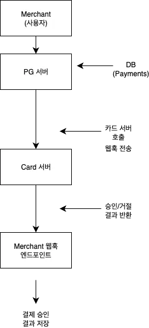
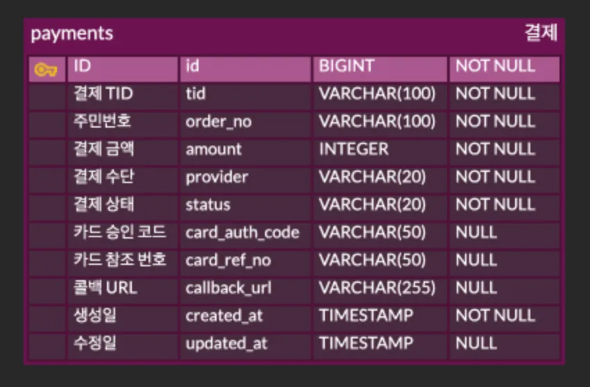
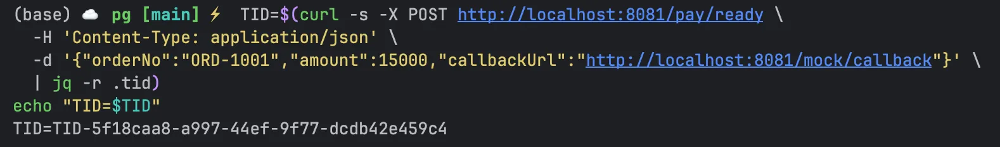
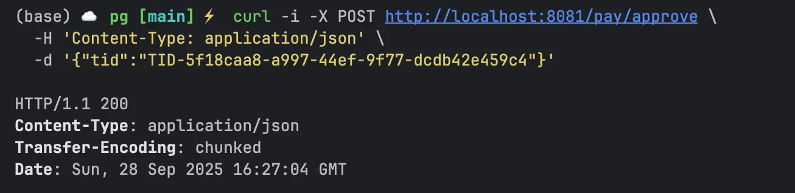
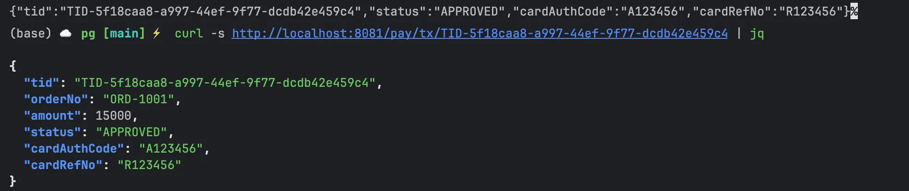
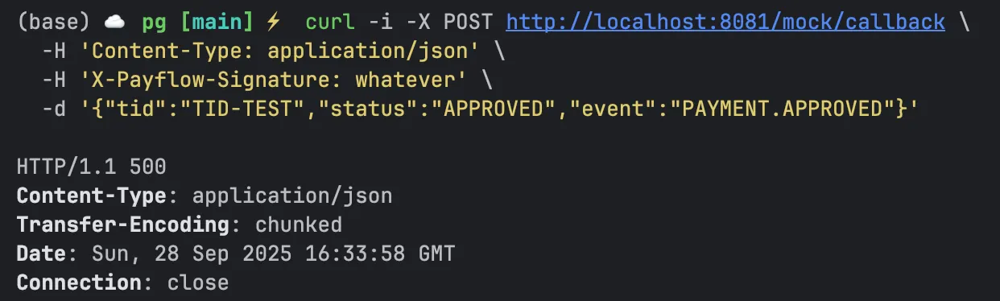
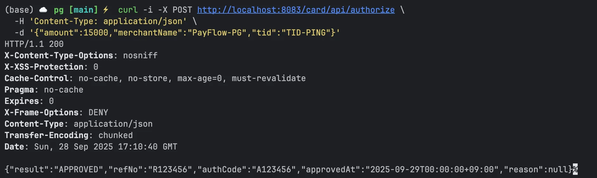

# 💳 PayFlow
## 분산 시스템 환경 기반 모의 결제 시스템 

<p align="center">
  
</p>

---

## 📌 프로젝트 소개
**PayFlow**는 실제 PG(Payment Gateway) 흐름을 모사한 **모의 결제 플랫폼**입니다.  

총 **3개의 서버(Merchant, PG, Card)** 가 통신하며, 멀티 서버 간 연동, Webhook 기반 비동기 이벤트 처리, 결제 도메인 설계, 보안(HMAC 서명)까지 포함한 실제와 유사한 결제 시나리오를 구현했습니다.


> 📂 GitHub Repository: [kimju-hee/PayFlow](https://github.com/kimju-hee/PayFlow)


---

## ⭐ 주요 기능

- **결제 준비** (`POST /pay/ready`)
    - 주문번호, 금액, 콜백 URL을 받아 **결제 식별자(TID)** 생성 후 DB에 저장
- **결제 승인** (`POST /pay/approve`)
    - 카드사 모듈 호출 → 성공 시 상태 갱신 및 **웹훅 전송**
- **거래 조회** (`GET /pay/tx/{tid}`)
    - 특정 TID에 대한 상태, 금액, 승인 코드 등을 조회
- **웹훅 전송**
    - 결제 승인/실패 이벤트를 가맹점 서버로 POST, **HMAC-SHA256 서명 포함**
- **Mock 카드사 서버**
    - `POST /card/api/authorize` → 승인/실패 응답 반환 (테스트 시나리오용)

---

## 📚 기술 스택
🔹 Backend
<p>   </p>
🔹 Database
<p>   </p>
🔹 Infra & DevOps
<p>   </p>
🔹 API & Test
<p>    </p>
🔹 Monitoring & Logging
<p>   </p>
---

## 🏗 아키텍처



---

## 🗄️ ERD



---

## 🔗 API 기본 명세
👉 [Notion API 문서 바로가기](https://www.notion.so/API-27834c547b0a800498e4cf03cd4990f0?pvs=21)

---

## ⚙️ 핵심 기능 상세

### 1) 결제 생성 (Ready)
- 거래 식별자 **TID** 생성 후 `Payments` 테이블에 `READY` 상태로 저장
- 프론트 결제 페이지로 넘길 **리다이렉트 URL 발급(모의)**



---

### 2) 결제 승인 (Approve)
- DB에서 TID 조회 → 상태 검증 (`READY`가 아니면 거절)
- **Card 서버 호출** (`/card/api/authorize`)
- 결과가 APPROVED면 상태를 `APPROVED`로 갱신, **승인코드/참조번호** 저장
- **Webhook** 이벤트 전송 (HMAC 서명 포함)



---

### 3) 거래 조회 (Get)
- 특정 TID의 거래 상태, 금액, 승인 코드 확인



---

### 4) 웹훅 수신 (Mock)
- 개발/운영 중 **서명 검증**과 **payload 로그** 확인 가능



---

### 5) 외부 결제사 연동 (Card)
- 실제 카드사 API를 모사 → **승인/거절 시나리오** 테스트 가능
- 엔드포인트: `POST /card/api/authorize`
- 요청: `{amount, merchantName, tid}`
- 응답: `{result, refNo, authCode, approvedAt, reason}`



---

## 🔧 실행 방법

```bash
# 1. PG 서버 실행
./gradlew :pg:bootRun

# 2. 카드사(Mock) 서버 실행
./gradlew :card:bootRun

# 3. 가맹점(Mock) 서버 실행
./gradlew :merchant:bootRun
